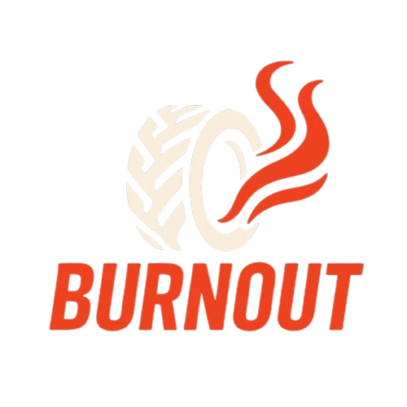

<p align="center">
  
</p>

<h1 align="center">🔥 BURNOUT</h1>

<p align="center">
  <em>The first 100% motorcycle-focused social network.</em><br>
  <strong>Ride. Share. Chat. Live full throttle.</strong>
</p>

<p align="center">
  <a href="https://github.com/your-username/burnout/actions">
    
  </a>
  <a href="https://opensource.org/licenses/MIT">
    
  </a>
</p>

---

## 🏍️ About

**Burnout** is the first social network 100% dedicated to motorcycle enthusiasts.  
No pointless chatter — just the roar of engines, burning rubber, and pure two-wheel passion.

Share your bikes, comment on community rides, and chat live with riders around the world via our built-in real-time messaging system.

Whether you're into café racers, sport bikes, customs, or off-road trails, **Burnout** is your tribe.

---

## 🚀 Features

- 🔐 Social authentication (OAuth)
- 🧑‍💻 Two-factor authentication (2FA)
- 💬 Real-time instant messaging (Pusher)
- 🏍️ Community feed & motorcycle showcases
- 📱 Responsive UI with Tailwind CSS
- ⚙️ Laravel MVC structure

---

## 🛠️ Tech Stack

| Layer             | Technology              |
|------------------|-------------------------|
| Framework        | Laravel                 |
| Frontend         | Livewire + Tailwind CSS |
| Real-time Engine | Pusher (WebSockets)     |
| Database         | PostgreSQL              |
| Package Managers | Composer, NPM           |

---

## 📦 Installation

### 🔧 Requirements

- PHP ≥ 8.2
- Composer
- Node.js ≥ 18
- PostgreSQL
- Pusher credentials

### ⚙️ Setup

```bash
# Clone the repo
git clone https://github.com/your-username/burnout.git
cd burnout

# Install backend dependencies
composer install

# Install frontend assets
npm install && npm run dev

# Copy and configure .env file
cp .env.example .env
php artisan key:generate

# Configure DB (PostgreSQL) & Pusher in .env
# Example:
# DB_CONNECTION=pgsql
# DB_HOST=127.0.0.1
# DB_PORT=5432
# DB_DATABASE=burnout
# DB_USERNAME=your_user
# DB_PASSWORD=your_password

# Run migrations
php artisan migrate

# Start the server
php artisan serve
```

---

## 🧪 Testing

Burnout includes plans for:

- ✅ Unit Tests (PHPUnit)
- ✅ Integration Tests
- ✅ Livewire Component Tests

To run all tests:

```bash
php artisan test
```

---

## 📸 Screenshots

> *Coming soon — UI preview, chat window, bike feed...*

---

## 🔄 CI/CD

GitHub Actions CI pipeline will be available in `.github/workflows/ci.yml`.

Badge reflects the status of the main branch builds:  


---

## 👨‍💻 Author

**Axel Duquelzar**  
🌐 [axelduquelzar.fr](https://axelduquelzar.fr)  
🔗 [LinkedIn](https://www.linkedin.com/in/axel-duquelzar)

---

## 📜 License

This project is licensed under the [MIT License](LICENSE).

> ⚠️ This is a side project created for learning and experimentation.  
> It is not intended for production deployment as-is.

---

## 🤘 Final Word

Burnout is not just code — it’s the spark for a community of riders.  
Join in, share your world, and ride full throttle.  

**#RideShareChat**
